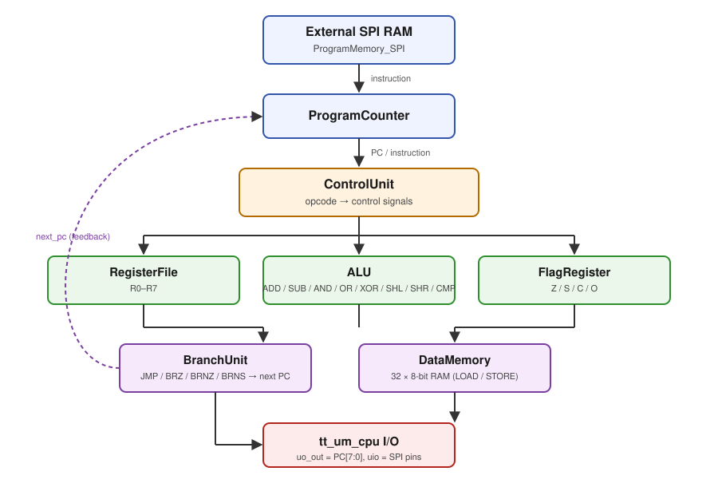

# RISC CPU – TinyTapeout / Sky130

A custom 16-bit RISC CPU implemented in Verilog, designed for silicon tape-out
on the [TinyTapeout](https://tinytapeout.com/) platform using the SkyWater
Sky130 open-source PDK. The CPU fetches its program from external SPI RAM,
decodes a 15-instruction ISA, and executes it on a small register-file/ALU
datapath with branch and data-memory support.

## Architecture



## Instruction Set (ISA)

15 instructions, 4-bit opcode (see [`defines.vh`](defines.vh)):

| Mnemonic | Opcode (bin) | Description                     |
|----------|--------------|----------------------------------|
| `ADD`    | `0000`       | Add two registers                |
| `ADDI`   | `0001`       | Add immediate                    |
| `SUB`    | `0010`       | Subtract two registers           |
| `AND`    | `0011`       | Bitwise AND                      |
| `OR`     | `0100`       | Bitwise OR                       |
| `XOR`    | `0101`       | Bitwise XOR                      |
| `LI`     | `0110`       | Load immediate                   |
| `L`      | `0111`       | Load from data memory            |
| `ST`     | `1000`       | Store to data memory             |
| `JMP`    | `1001`       | Unconditional jump               |
| `BRZ`    | `1010`       | Branch if zero                   |
| `BRNZ`   | `1011`       | Branch if not zero                |
| `BRNS`   | `1100`       | Branch if not negative/sign      |
| `SHL`    | `1101`       | Shift left                       |
| `SHR`    | `1110`       | Shift right                      |
| `CMP`    | `1111`       | Compare (sets flags)             |

## File Structure

```
├── src/                   # Synthesizable RTL (source of truth for the tape-out)
│   ├── tt_um_cpu.v         # Top-level TinyTapeout module
│   ├── ALU.v
│   ├── ControlUnit.v
│   ├── BranchUnit.v
│   ├── DataMemory.v
│   ├── FlagRegister.v
│   ├── ProgramCounter.v
│   ├── ProgramMemory_SPI.v
│   ├── register_file.v
│   ├── defines.vh
│   └── config.json          # OpenLane hardening config (mirrors root config.json)
├── test/                   # cocotb/Icarus test harness used by the TT CI flow
│   ├── tb.v, test.py, spi_flash_sim.v, isa_asm.py
├── testbenches/            # Per-module Icarus Verilog testbenches (see make.mak)
├── Compiler/               # Assembly translator + example programs
│   ├── AssemblyTranslator.py
│   ├── Source/
│   └── Output/
├── docs/                   # Architecture notes, GitHub Pages ISA doc site
├── info.yaml               # TinyTapeout project metadata (pinout, source list)
├── config.json              # OpenLane hardening configuration
├── make.mak                 # Convenience Makefile for running individual testbenches
└── .github/workflows/       # CI/CD pipeline (see below)
```

## CI/CD Pipeline

On every push to `main`, [`.github/workflows/gds.yaml`](.github/workflows/gds.yaml)
runs the full TinyTapeout hardening flow via GitHub Actions:

1. **`gds`** – Synthesis + place-and-route through OpenLane, producing the
   final GDSII layout for the Sky130A PDK.
2. **`precheck`** – TinyTapeout precheck (DRC/LVS and manufacturability
   rules) against the generated GDS.
3. **`gl_test`** – Gate-level simulation of the routed netlist to confirm
   functional equivalence with the RTL.
4. **`viewer`** – Generates the 3D layout viewer and publishes documentation
   via GitHub Pages.

## OpenLane Build Result

The RTL has been carried end-to-end through the OpenLane hardening flow for
the Sky130A PDK and produces a tapeout-ready GDSII layout:

| Stage | Result |
|---|---|
| Synthesis + place & route (`gds`) | ✅ Clean build, no blocking errors |
| DRC / LVS manufacturability precheck (`precheck`) | ✅ Clean |
| Gate-level simulation vs. routed netlist (`gl_test`) | ✅ Passing (see [#5](https://github.com/GlodiSala/risc-cpu-tinytapeout-sky130/pull/5): the old testbench reached into internal RTL signal names that don't survive synthesis; each test program now checks its own result and reports pass/fail via the PC, observable on real pins in both RTL and gate-level sim) |
| 3D viewer + docs publish (`viewer`) | ✅ Published |

**Post-route stats** (from the `gds` job's routing/cell-usage summary):

| Metric | Value |
|---|---|
| Routing utilization | 60.9 % |
| Total wire length | 62,943 µm |
| Total cells (excl. fill/tap) | 2,169 |
| Flip-flops | 391 |
| Combinational logic | 497 |
| Multiplexers | 341 |
| Fill + tap cells | 1,640 + 456 |

<details>
<summary>Full cell breakdown by category</summary>

| Category | Cells | Count |
|---|---|---|
| Fill | decap, fill | 1,640 |
| Combo logic | o22a, o221a, o2111a, or3b, a31o, and4bb, a32o, nor3b, or4bb, a211o, o31a, o21bai, and2b, and3b, a22oi, a22o, o41a, o211a, o21ba, o21ai, o21a, or4b, o221ai, a221oi, a221o, a21o, a21oi, o211ai, a2bb2o, a32oi, a31oi, o311a, o2111ai, a21bo, o2bb2a, a2111oi, o32a, o2bb2ai, o22ai, o31ai | 497 |
| Tap | tapvpwrvgnd | 456 |
| Flip-flops | dfxtp | 391 |
| Misc | conb, dlymetal6s2s, dlygate4sd3 | 368 |
| Multiplexer | mux2, mux4 | 341 |
| Buffer | clkbuf, buf, bufinv | 165 |
| OR | or2, or4, or3, xor2 | 121 |
| AND | and2, and3, and4, a21boi | 94 |
| NOR | nor2, xnor2, nor3 | 76 |
| NAND | nand3, nand2, nand2b, nand4 | 63 |
| Inverter | inv | 43 |
| Clock | clkinv | 8 |
| Diode | diode | 2 |

</details>

**Chip layout preview:**


**[Open the interactive 3D viewer →](https://gds-viewer.tinytapeout.com/?model=https://glodisala.github.io/risc-cpu-tinytapeout-sky130/tinytapeout.oas&pdk=sky130A)**

Both are regenerated automatically by [`.github/workflows/gds.yaml`](.github/workflows/gds.yaml)
on every push to `main` and published via GitHub Pages.

<details>
<summary>Notes on test coverage</summary>

Three of the `testbenches/` unit testbenches (`ProgramMemory_SPI_tb.v`,
`ControlUnit_tb.v`, `ProgramCounter_tb.v`, run via `make.mak`) predate recent
RTL changes and no longer match current module port lists, so they fail to
elaborate under Icarus Verilog. They are not part of the TinyTapeout CI flow
above (which uses `test/tb.v` instead), so they don't affect the hardening
pipeline, but they're out of date and should be refreshed:

- `spi` (`ProgramMemory_SPI_tb.v`) — instantiates `ProgramMemory_SPI`, but the
  module in `src/ProgramMemory_SPI.v` is actually named `ProgramMemory_SPI_RAM`.
- `control` (`ControlUnit_tb.v`) — references ports (`is_branch`, ...) that no
  longer exist on `ControlUnit`.
- `pc` (`ProgramCounter_tb.v`) — references ports (`branch_en`, `branch_addr`)
  that no longer exist on `ProgramCounter`.

`alu`, `cpu`, `data`, `flag`, and `reg` all build and pass with `make -f make.mak <target>`.

</details>

## Tools Used

- **Verilog** – RTL design and testbenches
- **Icarus Verilog** – RTL simulation (`iverilog`/`vvp`)
- **Python** – Assembly compiler/translator and cocotb-based tests
- **OpenLane** – RTL-to-GDS synthesis and hardening
- **Sky130A (SkyWater PDK)** – Open-source silicon process
- **TinyTapeout** – Shared-die tape-out program and CI tooling
